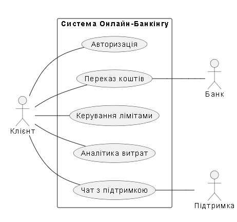

## Розділ 5. Проєктування системи за допомогою UML-нотації

У даному розділі представлена діаграма варіантів використання (Use Case Diagram), яка описує функціональні можливості системи онлайн-банкінгу та взаємодію основних дійових осіб (акторів) із нею.

### 5.1. Діаграма варіантів використання
Нижче зображена графічна модель взаємодії користувача з системою:

### 5.2. Опис елементів діаграми:
* **Актори:**
    * **Клієнт** — основний користувач, який ініціює операції.
    * **Банк (Процесинговий центр)** — зовнішня система, що підтверджує фінансові транзакції.
    * **Підтримка** — персонал, що забезпечує допомогу через чат.
* **Варіанти використання (Use Cases):**
    * **Авторизація** — вхід у систему для ідентифікації користувача.
    * **Переказ коштів** — виконання міжбанківських або внутрішніх платежів.
    * **Керування лімітами** — встановлення обмежень на витрати по картках.
    * **Аналітика витрат** — візуалізація статистики витрат користувача.
    * **Чат з підтримкою** — отримання оперативної допомоги в режимі реального часу.

### 5.3. Висновок
Діаграма демонструє, що система охоплює повний цикл обслуговування клієнта: від безпечного входу до проведення платежів та отримання підтримки.